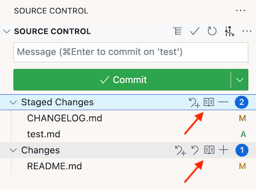
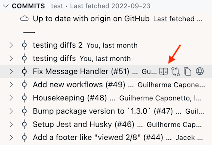
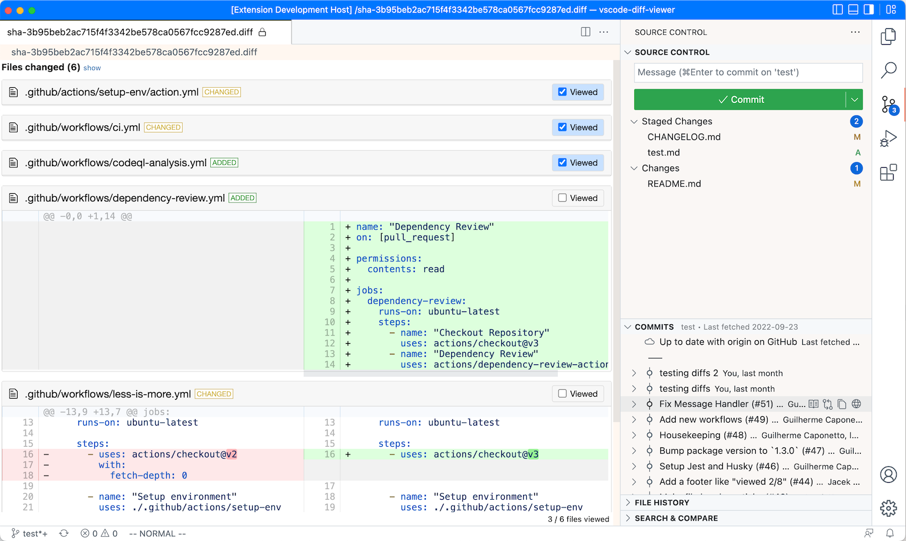

# Whole Diff VSCode Extension

This extension makes it possible to view the whole diff for working tree changes, staged changes, or a specific commit or stash (in GitLens commits/shashes lists).

## Features

The extension adds an icon to the "Staged Changes" and "Changes" groups which will open a diff that shows all the changes in a single diff file.

The same icon is also added to GitLens Commits and Stashes lists, where it opens the diff for that commit or stash.

With an extension like `Diff Viewer`, the diff looks like this:

There are also two new commands in the command pallette:

1. Show whole diff of staged changes
2. Show whole diff of working tree

You can add keyboard shortcuts to your liking for these commands.

## Requirements

This extension works best together with an extension that shows a diff file graphically; I use [Diff Viewer by Guilherme Caponetto](https://marketplace.visualstudio.com/items?itemName=caponetto.vscode-diff-viewer).

## Extension Settings

- `diffEditor.ignoreTrimWhitespace` is used to generate whitespace-ignoring diffs (with `git diff -b`)
- `diffviewer.outputFormat` controls whether to show side-by-side or inline diffs

This extension has no settings of its own. Let me know if you want any settings; for example to hide the buttons in a context menu.

## Known Issues

The diffs don't automatically refresh when there are git or settings changes; you have to run the command or click the button again.

## Release Notes

See [CHANGELOG.md](CHANGELOG.md)
